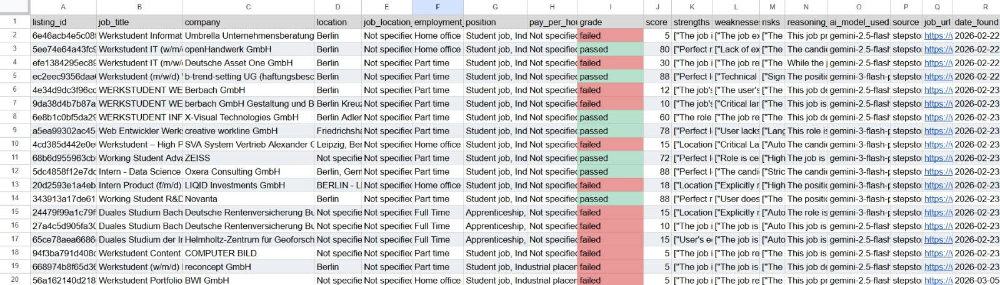
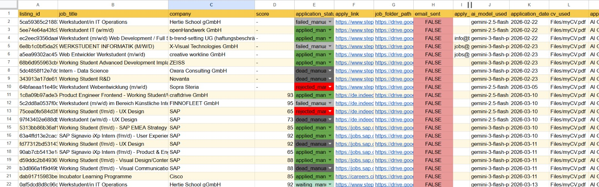

# JobAgent

After moving to Berlin, I found myself searching for job opportunities. However, due to the dense job market, I was spending too much time and effort mindlessly applying to offers on multiple job boards. As someone who values efficiency and his time, and noticing the lack of reliable job application tools, I developed this program within a couple of weeks and have been actively using it for the past week.

This is a personal assistant that evaluates and generates files to streamline the application process to ensure time efficiency when applying on a larger scale.

## What it does

- **Collects job offers** from the specified job boards into a JSON file and can also extract data from given URL links.  
- **Automatically creates a folder** on your Google Drive with a Google Sheet to store all applications.  
- **Evaluates the entries** from the JSON file using LLMs, comparing them against personal requirements and the user’s CV (please use a clear CV).  
- **Assigns a pass or fail grade.** For passed applications, it logs the result in a tab of the Google Sheet and generates personalized:  
  - Cover letter  
  - Email (Which can be automatically sent without user input)
  - Message
  *(You can choose to use the AI-generated versions or write them yourself.)*  
- **Organizes everything** in the Google Sheet with links for easy navigation and quick application submission.

## Here are screenshots of what you might expect your google sheet file to look like after an automated run

## Built With
 
- **Google Cloud Projects** — access to Google services
- **Google AI Studio (Gemini)** — AI evaluation and generation
- **Python** — scraping, navigation, and workflow logic
## How It Works
 
1. **Configuration** — reads user-defined config files to set run specifications and preferences
2. **Job Collection** — scrapes postings from LinkedIn, Indeed, and Stepstone by parsing HTML data and navigating pages via Python; LinkedIn postings are fetched through a third-party service
3. **Deduplication** — collects all postings and their data into a JSON file, removing duplicates and previously seen listings
4. **Evaluation** — Gemini 2.5 scores each posting against user-defined criteria and provides reasoning for each score
5. **Google Sheets Export** — results are written to a Google Sheet created automatically on initialization in the user's Drive
6. **Generation** — for postings that pass the score threshold, Gemini generates a tailored cover letter, email, and message based on the user's CV, job description, and requirements; generated files are uploaded to a named folder in the user's Drive
7. **Application Sheet** — a second Google Sheet is populated with organized fields, URL links to job postings, and links to generated folders for fast, efficient applying
8. **Cleanup** — temporary files generated during the run that are no longer needed are removed automatically
## Note
 
The program does not apply to jobs directly. Each job requires different data submitted on different domains, making full automation of the application step not feasible.

## Architecture

- **Job Collection:**  
  - Manual Input JSON (used in case of manual job inputs)  
  - URL to Input (used in case user wishes to feed the program direct urls instead of automated website searches)  
  - Automatically collected Input (used in case user wishes for the program to automatically scan job boards of specified websites)

- **Evaluation and generation:**  
  - Evaluates collected job postings  
  - Generates artifacts for passing grades  

- **Helper Function and API control**

## Setup Steps

**Note:** All files that have a name ending in *empty*, rename to remove the `" empty"` — this was done for ease of testing.  

- Download Project Dependencies that are in the `requirement.txt` file  
- You will need a Google account  
- You will have to create a Google Cloud Project and create authentication for it, and give it access to your: Gmail, Google Drive, Google Sheets  
- You will have to create a Google AI Studio profile  
- Take the API keys generated from the Google Cloud Project and Google AI Studio and put them in the `credentials.json` and the `.env` respectively  
- You will then have to read through the evaluation and generation prompts in the Run-Configs File and personalize them  
- Put your CV in the Files folder  
- Configure the `config.json` file in the Run-Configs  
- Configure the `configs.json` file in the `Job_Scrapers/stepstone` and `Job_Scrapers/indeed`  
- Run the `run.py` in the root folder

---

**Note:** I understand this is a barebone explanation and is missing full details. This project hasn't been run anywhere other than from my computer till now, so seeing bugs or facing setup difficulties is understandable. Please contact me, and if I am available I will do my best to help out as I can.
